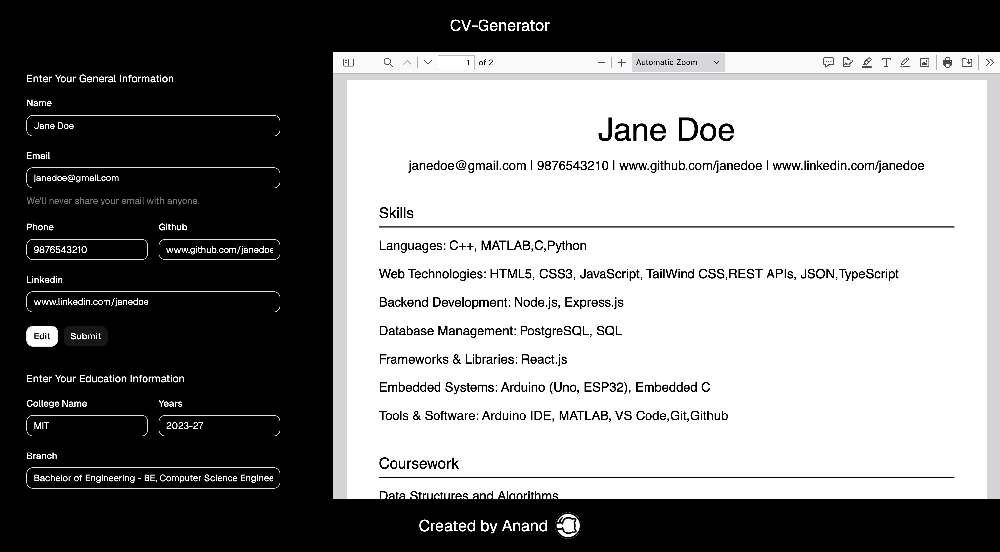

# CV Generator

A modern CV/Resume Generator built with **React**, **Vite**, **Tailwind CSS**, **shadcn/ui**, and **React PDF**. The application allows users to enter their resume details through an intuitive form and instantly preview a professionally formatted resume. All data is automatically saved to the browser's local storage, so refreshing the page does not erase the information.
---
## Features

- Live PDF preview while editing
- General Information section
  - Name
  - Email
  - Phone Number
  - GitHub
  - LinkedIn
- Education section
- Skills section
- Coursework section
- Projects section
- Automatic local storage saving
- Responsive two-panel layout
- Modern UI built with shadcn/ui and Tailwind CSS

---

## Tech Stack

- React
- Vite
- JavaScript
- Tailwind CSS
- shadcn/ui
- React PDF (`@react-pdf/renderer`)
- Local Storage API

---

## Project Structure

```
src/
│
├── components/
│   ├── Header.jsx
│   ├── Footer.jsx
│   ├── Sidebar.jsx
│   ├── Preview.jsx
│   ├── Resumepdf.jsx
│   ├── General.jsx
│   ├── Education.jsx
│   ├── Skills.jsx
│   ├── Coursework.jsx
│   └── Experience.jsx
│
├── App.jsx
├── main.jsx
└── index.css
```
---
The demonstration of the project can be found on (https://cv-generator-psi-three.vercel.app/)

